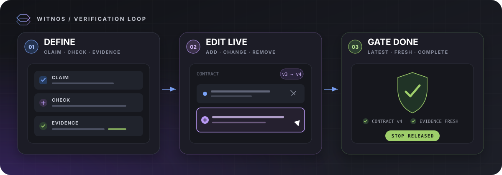

  

<h1 align="center">Witnos</h1>

<strong>コーディングエージェントに、自分の仕事を自己採点させない。</strong>

Claude が何を検証するかを見える化。実行中に変更。証拠が合わなければ停止させません。

  
  
  
  
  

<a href="README.md">English</a> · <a href="README.zh-Hant.md">繁體中文</a> · <strong>日本語</strong>

  
  Claude Code はそのままエージェントとして動き、Witnos は検証を見えるようにして完了を制御します。

## ひと目でわかる機能

| **証拠に出所を添付** ファイル、URL、コマンド | **実行中に編集** 変更した条件だけを送信 | **Stop gate** 最新版を確認 |
|:---|:---|:---|
| **session ごとに一つの目標** 別の作業と混ざらない | **ターミナルを維持** アプリ再起動後も会話が残る | **ローカルのみ／BYOK** クラウドも token proxy もなし |

## ソースからインストール

**必要なもの：** macOS · Claude Code · [rustup で管理した Rust](https://rustup.rs) · Node.js 20.19.x または ≥22.12

~~~sh
git clone https://github.com/Ruxiu0409/Witnos.git
cd Witnos
./scripts/install-app.sh
~~~

<strong>インストーラーの処理</strong>

アプリと CLI をビルドし、<code>/Applications/Witnos.app</code> にインストールし、同梱 CLI を検証してから Witnos を開きます。開かずに終えるには <code>--no-open</code> を付けてください。

## 30 秒で始める

| **1 · 監視** | **2 · 承認** | **3 · 起動** | **4 · Prompt** |
|:---|:---|:---|:---|
| プロジェクトを選ぶ | フォルダを信頼し <code>/hooks</code> を承認 | Witnos 内で <code>claude</code> を起動 | 最初の prompt が目標になる |

> [!IMPORTANT]
> Stop gate が有効になるのは監視対象のプロジェクトだけです。ほかのターミナルで起動した Claude には触れません。クラッシュ後に止まった場合は Witnos を開き直すか、プロジェクトルートで <code>/Applications/Witnos.app/Contents/Resources/bin/witnos disarm</code> を実行してください。

<strong>互換性、対象範囲、復旧</strong>

| | 現在 |
|---|---|
| 利用可能 | macOS + Claude Code |
| アプリ UI | English + 繁體中文 |
| 配布 | ソースビルド、未署名／未公証 |
| 未対応 | Linux テスト、Windows の永続ターミナル、主観判断用 prompt hook |

完全に解除するには **stop watching** を選びます。自動監視中のプロジェクトで <code>disarm</code> を実行しても一時的な解除にすぎず、Witnos の再起動で再び有効になります。監視していない間、インストール済み hooks は何もしません。

<strong>開発とコントリビュート</strong>

~~~sh
npm ci --prefix ui
npm --prefix ui run build
cargo test --workspace --exclude witnos-app
cargo clippy --workspace --exclude witnos-app --all-targets -- -D warnings
~~~

Issue と PR を歓迎します。大きな変更は先に issue を開き、[設計制約](docs/design.ja.md#設計原則これがこのプロジェクトの中身でありui-の話ではない)を読んでください。開発コマンドは [CLAUDE.md](CLAUDE.md)、背景は[設計ノート](docs/README.md)にあります。

## ライセンス

Copyright © 2026 CHENG YEH TSAI · [MIT](LICENSE-MIT) OR [Apache-2.0](LICENSE-APACHE)
